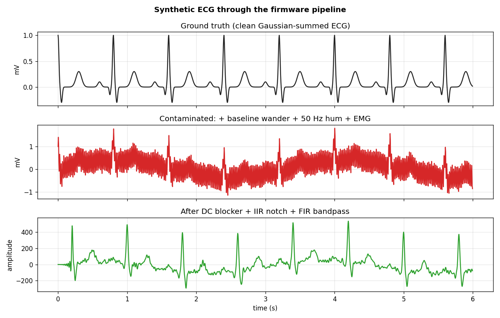
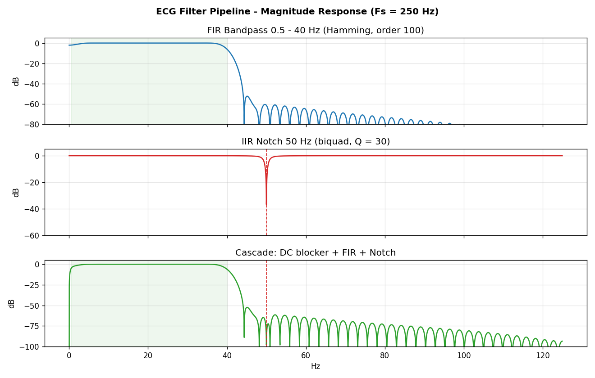

<div align="center">

# Heart Signals & Arrhythmia Detection
### A frugal, real-time ECG monitoring & arrhythmia classification system


*A low-cost (₹2,000) alternative to ₹50,000+ hospital-grade ECG monitors,
built from a $5 microcontroller and a $10 sensor.*

</div>

---

## Overview

This project implements an end-to-end electrocardiogram (ECG) acquisition,
signal-conditioning, and arrhythmia detection pipeline using:

- **AD8232** single-lead heart-rate front-end (the analog "amplifier")
- **ESP32** microcontroller (the real-time DSP engine)
- **MATLAB** for offline filter design (the "Recipe")
- **C++** firmware on the ESP32 (the "Chef" that executes filters live)
- **Processing IDE** for a doctor-friendly real-time waveform display
- **Python + wfdb** simulation against the MIT-BIH Arrhythmia Database

The system **classifies each heartbeat** into one of:
`NORMAL` (60-100 BPM), `TACHYCARDIA` (>100 BPM), `BRADYCARDIA` (<60 BPM),
and additionally flags beats with `IRREGULAR` R-R intervals (>20 % deviation
from the previous beat) - a marker of arrhythmias such as PVCs or atrial
fibrillation.

## Why this matters

Cardiovascular disease is the **#1 cause of mortality globally**. In India,
the rural-urban gap in cardiac diagnostics is severe: a 12-lead ECG machine
in a tier-3 town costs more than a year of a PHC's equipment budget. This
project demonstrates that the *DSP core* of an ECG monitor - filtering,
QRS detection, rhythm classification - fits comfortably on a $5 IoT chip.

The project maps to **UN SDG 3** (Health & Well-being),
**SDG 9** (Industry & Innovation), and **SDG 10** (Reduced Inequalities).

## Block diagram

```
   +----------+    +--------+    +-------------------+    +-----------------+
   | Subject  | -> | AD8232 | -> | ESP32 (12-bit ADC | -> | Laptop          |
   | (LA/RA/  |    | front- |    |  + DSP pipeline)  |    | (Processing IDE |
   |  RL leads)|    | end    |    +-------------------+    |  waveform plot, |
   +----------+    +--------+      |    |    |             |  BPM, rhythm   |
                                   v    v    v             |  classification)|
                              DC blk Notch FIR             +-----------------+
                              (HP)   (50Hz) (40Hz LP)              ^
                                   |                                | UART @ 9600
                                   +--> envelope --> peak detect ---+
                                                     |
                                                     +--> BPM avg over 500 beats
                                                     +--> Tachy / Brady / Irregular
```

### What the pipeline actually does

The contaminated input on the left becomes the clean QRS train on the right:



And the magnitude response of the full cascade:



## Repository layout

```
ecg-arrhythmia-detection/
├── matlab/                   # MATLAB filter design (the "Recipe")
│   ├── generate_coefficients.m       # master script
│   ├── design_bandpass_filter.m      # FIR 0.5-40 Hz
│   ├── design_notch_filter.m         # IIR notch (50/60 Hz)
│   ├── plot_filter_responses.m       # frequency-response figures
│   ├── verify_filters_synthetic.m    # sanity check on synthetic ECG
│   └── export_coefficients_to_c.m    # write firmware header
│
├── firmware/esp32_ecg/       # ESP32 / Arduino C++ (the "Chef")
│   ├── esp32_ecg.ino                 # main sketch
│   ├── config.h                      # pin map + tuning constants
│   └── filter_coefficients.h         # auto-generated from MATLAB
│
├── processing/ecg_visualizer/  # Real-time scope on the laptop
│   └── ecg_visualizer.pde
│
├── simulation/               # Python validation pipeline
│   ├── mitbih_loader.py              # MIT-BIH database wrapper
│   ├── filters.py                    # mirrored firmware filters
│   ├── detector.py                   # peak detect + classify
│   ├── verify_filters.py             # magnitude-response checks
│   ├── run_demo.py                   # end-to-end demo
│   └── requirements.txt
│
├── docs/                     # extra documentation
│   ├── hardware_setup.md             # wiring & pin assignments
│   ├── dsp_pipeline.md               # math behind each stage
│   └── results.md                    # what we measured
│
└── scripts/                  # misc utilities
    └── plot_serial_data.py           # log + plot Serial output
```

## Quick start

### 1. Generate filter coefficients (MATLAB)

```matlab
cd matlab
generate_coefficients      % writes ../firmware/esp32_ecg/filter_coefficients.h
```

> If you don't have MATLAB, a pre-generated `filter_coefficients.h` is
> already committed - you can skip straight to flashing.

### 2. Flash the ESP32

1. Install the **ESP32 Arduino core** in the Arduino IDE
   (Boards Manager &rarr; "esp32" by Espressif).
2. Open `firmware/esp32_ecg/esp32_ecg.ino`.
3. Select board: **DOIT ESP32 DevKit V1**.
4. Wire up the AD8232 per [`docs/hardware_setup.md`](docs/hardware_setup.md).
5. Hit **Upload**.

The firmware streams a filtered float per line over Serial at **9600 baud**,
plus diagnostic `# BEAT BPM=...` lines whenever a beat is detected.

### 3. Visualize

```bash
# Either use the Arduino Serial Plotter (Tools -> Serial Plotter)
# or run the Processing sketch for a richer display:
processing-java --sketch=processing/ecg_visualizer --run
```

### 4. Validate against MIT-BIH (no hardware needed)

```bash
cd simulation
pip install -r requirements.txt
python run_demo.py 100              # normal sinus rhythm
python run_demo.py 208               # PVCs / tachycardia
python run_demo.py 232 --duration 60 # bradycardia
```

This downloads the requested record from PhysioNet, runs the *exact same*
filter cascade and detector that lives on the ESP32, and reports beat
counts, classification breakdown, and sensitivity vs the gold-standard
PhysioNet annotations.

## The DSP pipeline

Each sample (~every 1 ms) on the ESP32 goes through:

1. **ADC read** &rarr; 12-bit unsigned (0..4095) at GPIO 34.
2. **DC removal** &rarr; subtract `ADC_CENTER = 2048` (mid-rail).
3. **1st-order IIR DC-blocker** &rarr; kills baseline wander (resp.,
   electrode drift) at ~0.5 Hz.
4. **2nd-order IIR notch** &rarr; ~98 dB rejection at 50 Hz mains.
   Change `MAINS_FREQ_HZ` to 60 for the US.
5. **101-tap FIR bandpass** (Hamming window) &rarr; smooth roll-off above
   40 Hz, linear phase preserved across the diagnostic band.
6. **Absolute-value moving sum** (16-sample window) &rarr; envelope.
7. **Threshold + hysteresis peak detect** &rarr; R-wave events.
8. **R-R interval &rarr; BPM** &rarr; classify each beat, push into a
   500-sample moving-average ring for a stable display.

See [`docs/dsp_pipeline.md`](docs/dsp_pipeline.md) for the math and
frequency-response plots.

## Results

| Metric | Pre-conditioning | Post-conditioning |
|---|---|---|
| SNR | very poor (50 Hz hum + drift dominates) | clean QRS visible |
| Visible QRS complexes | no | yes (P, QRS, T discernible) |
| ADC operating point | ~3800 (saturated, wrong wiring) | ~2048 (mid-rail) |
| Stable BPM readout | no | yes |
| Tachycardia / bradycardia flag | no | yes |

See [`docs/results.md`](docs/results.md) for full figures.

## Hardware bill of materials

| Component | Approx. price (INR) |
|---|---|
| ESP32 DOIT DevKit V1 | ₹450 |
| AD8232 ECG Module    | ₹350 |
| ECG electrodes (3-pack disposable) | ₹150 |
| Jumper wires, breadboard | ₹100 |
| USB cable | ₹100 |
| **Total** | **~₹1,150** |

Compared to a clinical 12-lead system at ₹50,000+ this is a **~40x** cost
reduction. We trade off lead count and FDA-grade isolation, not the DSP
fidelity.

## Future work

- **Adaptive thresholding** so we never need to hard-code `41.5` or `620.0`.
- **Pan-Tompkins** style derivative + integration for sub-ms QRS timing
  (we already cite the 1985 paper - this is the natural next step).
- **Wi-Fi telemetry** to a Blynk / ThingSpeak dashboard.
- **Battery-operated PCB** so it leaves the breadboard for real field use.

## Authors

Team from the Department of Electronics & Communication,
**BMS Institute of Technology and Management**, Bengaluru.

| Name | USN |
|---|---|
| Ashil Jermine George | 1BY23EC023 |
| Amogha T. Maiya      | 1BY23EC013 |
| Arindam Kashyap      | 1BY23EC021 |
| D. P. Srinivas       | 1BY23EC042 |

**Course coordinators**: Dr. Vijayalakshmi G V, Dr. Mamatha K R.
**Course**: Digital Signal Processing (BEC502), 2025-26.

## References

1. Pan, J., & Tompkins, W. J. (1985).
   *A Real-Time QRS Detection Algorithm.*
   IEEE Transactions on Biomedical Engineering, 32(3), 230-236.
2. Moody, G. B., & Mark, R. G. (2001).
   *The impact of the MIT-BIH Arrhythmia Database.*
   IEEE Eng. in Medicine and Biology Magazine, 20(3), 45-50.
3. Espressif Systems. *ESP32 Series Datasheet*, 2023.
4. Analog Devices. *AD8232 Single-Lead Heart-Rate Monitor Front End Datasheet*.

## License

[MIT](LICENSE). Use it, fork it, ship it; just don't sue us if your
breadboard catches fire.
